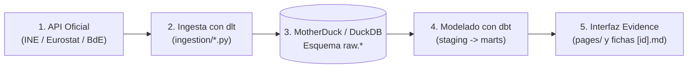

# Guía de Ingesta, Modelado y Añadido de Nuevas Métricas en SpainFacts

Esta guía explica paso a paso cómo funciona el pipeline de datos de **SpainFacts** y cómo cualquier desarrollador o analista puede añadir nuevos indicadores procedentes del **INE**, **Eurostat**, **Banco de España** o cualquier otra fuente oficial sin necesidad de herramientas automáticas.

---

## 1. Arquitectura del Flujo de Datos

El pipeline de SpainFacts sigue el patrón moderno **ELT (Extract, Load, Transform)**:



1. **Ingesta (`ingestion/`):** Scripts en Python usando [`dlt`](https://dlthub.com/) que consultan las APIs públicas y guardan los datos en el esquema `raw` de la base de datos (MotherDuck / DuckDB).
2. **Transformación (`transform/`):** Modelos de [`dbt`](https://www.getdbt.com/) que limpian fechas, estandarizan nombres y combinan series en tablas analíticas (`staging/` y `marts/`).
3. **Catálogo (`transform/seeds/metricas_catalogo.csv`):** Fichero de metadatos con el nombre amigable, unidad, organismo y enlace a la fuente original.
4. **Presentación (`pages/`):** Páginas markdown y componentes Svelte que consumen las tablas vía SQL.

---

## 2. Cómo añadir una nueva métrica del INE (Instituto Nacional de Estadística)

El INE expone sus datos a través de su API pública **Tempus3** (`servicios.ine.es/wstempus/js/ES/DATOS_TABLA/<ID_TABLA>`).

### Paso 1: Encontrar el ID de la tabla en la web del INE
1. Entra en [ine.es](https://www.ine.es) y busca la estadística que deseas (ej. *Cifras de Población*, *Salarios*, *Turismo*).
2. En la URL de la tabla del INE verás un parámetro `t=XXXXX` (por ejemplo, para el IPC es `t=50902`, para la EPA es `t=65219`). Ese número es el **`ID_TABLA`**.

### Paso 2: Añadir la tabla a `ingestion/ine.py`
Abre [`ingestion/ine.py`](file:///home/jota/Projects/dev/spainfacts/spainfacts.github.io/ingestion/ine.py) y añade una nueva clave en el diccionario `TABLAS`:

```python
TABLAS = {
    "ine_ipc": "50902",
    "ine_paro": "65219",
    "ine_salarios": "28191",  # <-- NUEVA TABLA
}
```

### Paso 3: Declarar la fuente en dbt
Abre [`transform/models/sources.yml`](file:///home/jota/Projects/dev/spainfacts/spainfacts.github.io/transform/models/sources.yml) y añade la nueva tabla dentro de `tables:`:

```yaml
sources:
  - name: raw
    schema: raw
    tables:
      - name: ine_ipc
      - name: ine_paro
      - name: ine_salarios   # <-- NUEVA TABLA
```

### Paso 4: Crear el modelo de staging en dbt
Crea el archivo `transform/models/staging/stg_ine_salarios.sql`:

```sql
select
    cod_serie,
    serie,
    -- Convierte la fecha epoch en milisegundos a formato fecha de DuckDB
    epoch_ms(cast(fecha as bigint))::date as date,
    anyo as year,
    valor as value
from {{ source('raw', 'ine_salarios') }}
where valor is not null
```

### Paso 5: Registrar la métrica en el catálogo
Abre [`transform/seeds/metricas_catalogo.csv`](file:///home/jota/Projects/dev/spainfacts/spainfacts.github.io/transform/seeds/metricas_catalogo.csv) y añade una fila con el identificador único y el código de la serie concreta (que puedes ver en los datos de la API en el campo `COD`):

```csv
metrica_id,nombre,unidad,fuente,url_fuente,cod_serie
salario_medio,Ganancia media anual por trabajador,€,INE,https://www.ine.es/jaxiT3/Tabla.htm?t=28191,ETES28191_1
```

¡Listo! La métrica se integrará automáticamente en la tabla `mother.metricas` y tendrá su ficha creada en `/indicadores/salario_medio`.

---

## 3. Cómo añadir un nuevo dataset de Eurostat (JSON-stat 2.0)

Eurostat utiliza el estándar de difusión **JSON-stat 2.0** para todas sus estadísticas europeas y nacionales.

### Paso 1: Localizar el dataset en Eurostat Data Browser
1. Entra en [Eurostat Data Browser](https://ec.europa.eu/eurostat/databrowser/).
2. Busca el dataset (ej. `gov_10a_exp` para gasto público, `prc_hicp_manr` para inflación armonizada, `une_rt_m` para paro).
3. El nombre del dataset es el código alfanumérico (ej. `gov_10a_exp`).

### Paso 2: Añadir el recurso en `ingestion/eurostat.py`
Abre [`ingestion/eurostat.py`](file:///home/jota/Projects/dev/spainfacts/spainfacts.github.io/ingestion/eurostat.py). Usamos la función genérica `parse_json_stat_series()` que decodifica automáticamente cualquier estructura multidimensional de Eurostat:

```python
@dlt.resource(name="eurostat_pib_trimestral", write_disposition="replace")
def pib_trimestral():
    url = (
        "https://ec.europa.eu/eurostat/api/dissemination/statistics/1.0/data/"
        "namq_10_gdp?freq=Q&geo=ES&unit=CLV10_MNAC&na_item=B1GQ&format=JSON&lang=EN"
    )
    resp = requests.get(url, timeout=120)
    resp.raise_for_status()
    for coords, valor in parse_json_stat_series(resp.json()):
        yield {
            "periodo": coords.get("time"),      # ej. "2024-Q2"
            "unidad": coords.get("unit"),
            "valor": valor,
        }
```

No olvides añadir la nueva función a la lista devuelta por `@dlt.source`:
```python
return [deuda, balance, gastos, ingresos, pib_trimestral]
```

### Paso 3: Crear el staging y marts en dbt
1. Declara la tabla en [`transform/models/sources.yml`](file:///home/jota/Projects/dev/spainfacts/spainfacts.github.io/transform/models/sources.yml).
2. Crea `transform/models/staging/stg_eurostat_pib_trimestral.sql`:
   ```sql
   select
       make_date(
           cast(substr(periodo, 1, 4) as integer),
           (cast(substr(periodo, 7, 1) as integer) - 1) * 3 + 1,
           1
       ) as periodo,
       unidad,
       valor
   from {{ source('raw', 'eurostat_pib_trimestral') }}
   where valor is not null
   ```
3. Registra el `metrica_id` en [`transform/seeds/metricas_catalogo.csv`](file:///home/jota/Projects/dev/spainfacts/spainfacts.github.io/transform/seeds/metricas_catalogo.csv) y agrégalo a [`transform/models/marts/metricas.sql`](file:///home/jota/Projects/dev/spainfacts/spainfacts.github.io/transform/models/marts/metricas.sql).

---

## 4. Cómo añadir fuentes de Banco de España o REE (Red Eléctrica)

Para fuentes que ofrecen APIs REST directas o descargas en CSV:

1. **Red Eléctrica de España (ESIOS / REE):**
   * Endpoint de generación eléctrica y demanda: `https://api.esios.ree.es/indicators/<ID_INDICADOR>`
   * Puedes crear `ingestion/ree.py` con una función `@dlt.resource` que lea el JSON y emita filas con `fecha`, `valor` y `tipo_generacion` (Solar, Eólica, Nuclear, etc.).
2. **Banco de España (BdE):**
   * El Banco de España publica series temporales en CSV/REST en su [portal de estadísticas](https://www.bde.es/wbe/es/estadisticas/).
   * Se procesan igual mediante un recurso de `dlt` que lea el CSV con `csv.DictReader` o `pandas` y lo cargue en MotherDuck.

---

## 5. Comandos de Terminal para Ejecutar y Probar

Para probar tus cambios localmente paso a paso:

```bash
# 1. Configurar variables de entorno (asegúrate de tener tu MOTHERDUCK_TOKEN en .env)
export $(cat .env | xargs)

# 2. Ejecutar la ingesta de datos a MotherDuck (Python)
python -c "import dlt; from ingestion.ine import ine; dlt.pipeline(pipeline_name='ine', destination='motherduck', dataset_name='raw').run(ine())"
python -c "import dlt; from ingestion.eurostat import eurostat; dlt.pipeline(pipeline_name='eurostat', destination='motherduck', dataset_name='raw').run(eurostat())"

# 3. Ejecutar las transformaciones y tests de dbt
cd transform
dbt seed --profiles-dir .
dbt run --profiles-dir .
dbt test --profiles-dir .
cd ..

# 4. Compilar y previsualizar Evidence en local
npm run sources
npm run dev
```

---

## 6. Buenas Prácticas y Consejos

1. **Idempotencia (`write_disposition="replace"`):**
   * Las series temporales oficiales son relativamente ligeras (unos miles de filas). Usar `replace` en `dlt` garantiza que si ejecutas el script 10 veces, no duplicas datos y siempre tienes la foto más exacta publicada por el organismo oficial.
2. **Tipos de Datos en dbt:**
   * Convierte siempre las fechas al tipo `DATE` estándar de DuckDB (`make_date(...)` o `epoch_ms(...)`).
   * Asegúrate de filtrar `where valor is not null` para evitar caídas en gráficos continuos.
3. **Tests de dbt:**
   * En `transform/models/marts/schema.yml`, añade tests de `not_null` y `unique` sobre `(metrica_id, periodo)`. Si una API pública cambia de formato inesperadamente, `dbt test` fallará y el pipeline de Dagster detendrá el despliegue para evitar publicar gráficos rotos.
